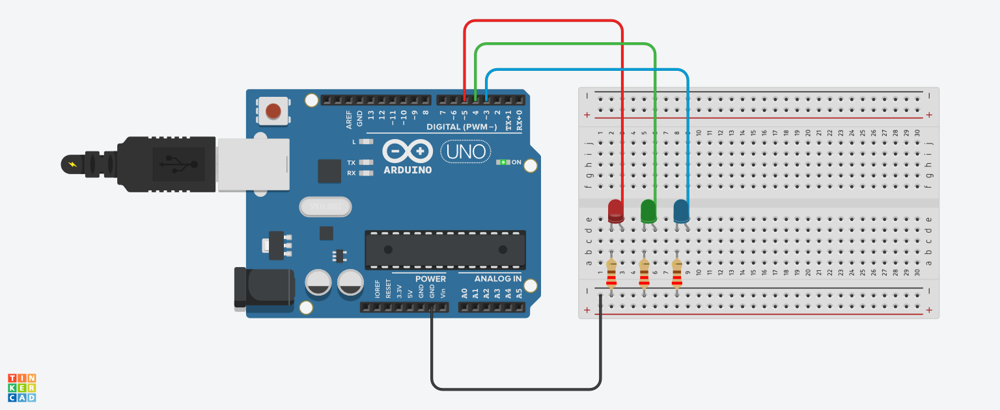

# Blink

This example blinks three LEDs hooked up to digital pins 3-5:

[Simulation on Tinkercad](https://www.tinkercad.com/things/akCBnRWabCl)

## References

* <https://www.youtube.com/watch?v=e1FVSpkw6q4>
* <https://www.arduino.cc/en/Tutorial/DigitalPins>
