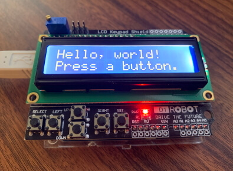
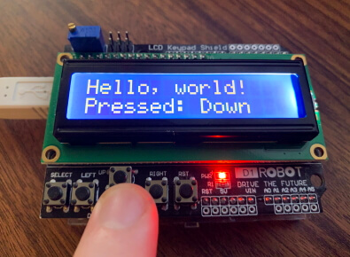

# lcd-shield

This program tests the DFRobot DFR0009 LCD keypad shield's display and buttons.

## References

* <https://wiki.dfrobot.com/Arduino_LCD_KeyPad_Shield__SKU__DFR0009_>
* <https://wiki.dfrobot.com/LCD_KeyPad_Shield_For_Arduino_SKU__DFR0009>
* <https://www.arduino.cc/en/Reference/LiquidCrystal>
